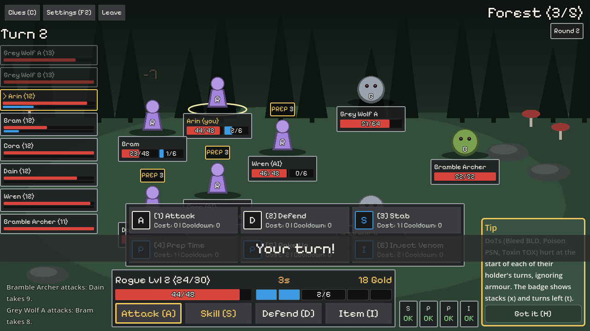
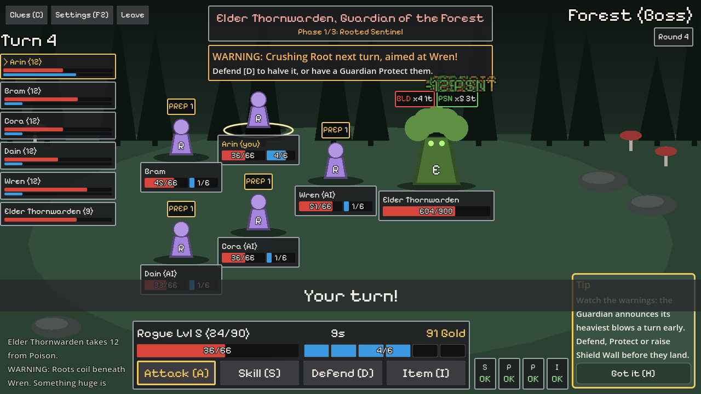
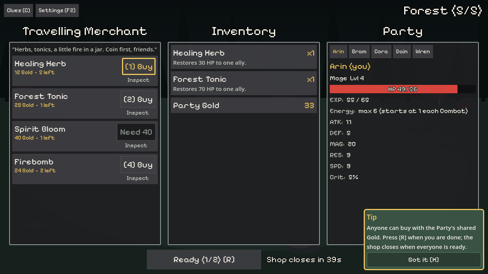

# BEYOND THE WORLD'S END — Forest vertical slice

Online co-op fantasy turn-based RPG built with **Godot 4.7** and **GDScript**.
The current goal is the Forest vertical slice described in
[issue #2](https://github.com/qqkiller-programmer-myself-2006/project-gamedev/issues/2).

- Domain glossary: [`CONTEXT.md`](CONTEXT.md)
- Decisions: [`docs/adr/`](docs/adr/)
- Product requirements: [`docs/prd.md`](docs/prd.md)
- Testing guide: [`docs/testing.md`](docs/testing.md)
- Running server and clients: [`docs/running.md`](docs/running.md)
- Balance and pacing: [`docs/balance.md`](docs/balance.md)
- Browser build: [`docs/web.md`](docs/web.md)
- Accessibility checklist: [`docs/accessibility.md`](docs/accessibility.md)
- Staging and QA checklist: [`docs/staging.md`](docs/staging.md)

## Project layout

```text
project.godot          Godot project (one codebase for server, PC and browser)
content/forest.json    All Forest content, text and balance numbers
assets/fonts/          Pixelify Sans (OFL, see OFL.txt) for headings, buttons and numbers
src/core/              Injected dependencies: GameRng, ManualClock, SystemClock, ForestContent
src/match/             Authoritative game logic behind the Match interface (MatchServer),
                       including StatusBook (Status effects / DoTs)
src/net/               Wire protocol, WebSocket server transport and client connection
src/server/            Headless server node (GameServer)
src/client/            Client UI: screens, per-phase panels, theme, settings, sounds
src/client/battle/     Full-screen BattleView (fights) and CampView (Merchant / Rest)
src/app/               Entry point: --server starts the server, otherwise the client
tests/                 Headless tests (runner, Match tests, regression, network)
tools/                 simulate.gd (balance), ui_preview.gd (screenshots), web_smoke.mjs
deploy/                Staging: server container, Caddy (HTTPS + wss proxy), compose
scripts/               Command-line helpers
docs/references/       AAC Rogue reference screenshots the battle/camp UI follows
docs/screenshots/      Current battle and camp screens (from tools/ui_preview.gd)
```

## Quick start

```bash
# Godot 4.7.2 must be on PATH as `godot` (or set GODOT=/path/to/godot)
./scripts/run_tests.sh                               # all tests, headless
godot --headless --path . -- --server --port=8910    # authoritative server
godot --path . -- --url=ws://127.0.0.1:8910          # PC client (open two for co-op)
```

## The Match interface

`MatchServer` (`src/match/match_server.gd`) is the only seam game logic is
tested through. It receives three dependencies from outside — a `GameRng`
seed, a clock and `ForestContent` — and exposes:

| Call | Purpose |
| --- | --- |
| `open_session()` | Anonymous session for a new connection |
| `command(session, cmd)` | Apply a command; returns `{"ok": true, ...}` or `{"ok": false, "error": code}` |
| `update()` | Process timers due at `clock.now()` |
| `take_events(session)` | Events this session should see |
| `snapshot(session)` | State this session should see |
| `close_session(session)` | Connection dropped |

## งานล่าสุด: Energy, DoT, Rogue และหน้าจอแบบ AAC

รวมอยู่ใน [PR #29](https://github.com/qqkiller-programmer-myself-2006/project-gamedev/pull/29)
(ปิด #22–#26) โดยอ้างอิงระบบและหน้าตาจากเกม An Average Campaign
([`docs/references/aac_rogue/`](docs/references/aac_rogue/README.md))

| ตั๋ว | สิ่งที่ทำ | การตัดสินใจ |
| --- | --- | --- |
| #22 | **Energy** ทุก Class: เริ่ม Combat ที่ 1 (ใช้ได้ใน turn แรก), +1 ทุก turn ถัดไป, สูงสุด 6, รีเซ็ตทุก Combat; Skill ใช้ Energy ร่วมกับ cooldown ส่วน Attack, Defend และ Item ใช้ได้ฟรี; server ปฏิเสธด้วย `not_enough_energy` | [ADR-0009](docs/adr/0009-energy-and-cooldown-skills.md) แทน ADR-0005 |
| #23 | **Status effect / DoT**: Bleed, Poison, Toxin ติดบนเป้าเดียวพร้อมกันได้ ซ้อน stack ได้ ทำ damage ตอนเริ่ม turn ของตัวที่ติด (ก่อนได้ Energy) โดยไม่ผ่าน DEF/RES ทำให้ล้มได้ และถูกล้างเมื่อจบ Combat | [ADR-0010](docs/adr/0010-rogue-class-and-dot-status-effects.md) |
| #24 | **Rogue** Tier 1 Class ตัวที่ 5 (Bandit Hideout): Stab, Prep Time, Poke Up, Inject Venom, passive **Enervation**, AI preset และการรองรับใน `MatchBot` | ADR-0010 ขยาย scope ของ ADR-0003 |
| #25 | **Battle HUD** เต็มจอ (ภาพ 04–07, 11): initiative timeline, สนาม 2D ที่ token วาดด้วยโค้ด, badge ของ DoT, HUD ล่างที่มีแถบ Energy 6 ช่อง, Skill grid แบบ "Cost \| Cooldown", ช่องนับ cooldown, action banner และข้อความ reward | ปุ่มยังเป็น Attack / Skill / Defend / Item ตาม `CONTEXT.md` |
| #26 | **หน้าแคมป์** 3 คอลัมน์สำหรับ Merchant และ Rest (ภาพ 08): ร้าน \| คลัง Item \| stat ตัวละคร พร้อมปุ่ม "Ready (x/y)" | ไม่มี Crafting, Equipment และการโอน Gold (อยู่นอกขอบเขต spec) |





### ผลการตรวจสอบ

- `./scripts/run_tests.sh`: **227 passed, 0 failed** รวม test ใหม่ของ Energy, Status effect, Rogue และข้อมูลที่หน้าจอใช้
- CI ของ PR #29 ผ่านทั้ง 2 job: headless GDScript tests และ export PC/browser/server พร้อม cross-platform smoke test
- Balance จาก 100 seed ต่อโหมด ([balance.md](docs/balance.md)): Single-player ชนะ **90%**, Duo co-op ชนะ **86%** อยู่ในช่วงที่กำหนด 70–97% แต่ง่ายขึ้นจากก่อนมี Rogue (86% / 81%)
- หน้าจอ: `tools/ui_preview.gd --class=rogue` เล่น Match จริงผ่านคีย์บอร์ดแล้วจับภาพทุกหน้าจอ และทดลองเล่น browser build กับ server ในเครื่องจนถึงการเลือกเป้า

### คะแนน review

Claude ประเมินงานของตัวเอง ยังไม่ใช่ review จากคนหรือ agent อื่น จึงควรมี review อิสระก่อน merge คะแนนเต็ม 10

| ด้าน | คะแนน | เหตุผล |
| --- | --- | --- |
| Logic ถูกต้องตาม ADR | 8.5 | ทุกกติกาใน ADR-0009/0010 มี test ผ่าน Match interface มี test ว่า AI ไม่ใช้ Skill ที่ Energy ไม่พอ และ `MatchBot` ไม่มีคำสั่งถูกปฏิเสธเลยใน 200 Match; หักเพราะ `StatusBook` รับชื่อ status ที่ไม่มีใน content โดยไม่แจ้ง error (จะติด damage ขั้นต่ำ 1) และ Enervation เพิ่ม damage ของ Item ด้วย ซึ่งเป็นการตีความที่ยังไม่ได้ยืนยัน |
| Test coverage | 8.5 | ทุก Skill, stack, ลำดับ tick, การล้มจาก DoT และ modifier มี test ด้วยค่าคงที่; หักเพราะฝั่ง UI มีแค่ compile test กับภาพจาก preview ไม่มี test อัตโนมัติของ layout |
| Balance | 7 | อยู่ในช่วงที่กำหนด แต่ Single-player ขยับขึ้นไป 90%; วัดแบบไม่มี `--pace` และยังไม่มีคนเล่นจริง |
| ความเหมือนภาพอ้างอิง | 8 | ตำแหน่งและองค์ประกอบตรงกับภาพ 04–08; หักเพราะตัวละครยังเป็นรูปทรง placeholder, แถบใน timeline ไม่มีตัวเลข และ banner ทับ Skill grid ได้ชั่วครู่ |
| Accessibility | 6.5 | สีมีตัวย่อกำกับเสมอ, ใช้คีย์บอร์ดได้, เคารพการลด motion; หักเพราะยังไม่ได้ตรวจหน้าจอใหม่ที่ขนาดตัวหนังสือใหญ่, คำอธิบายสินค้าในร้านเห็นได้แค่ tooltip ของเมาส์ และ [accessibility.md](docs/accessibility.md) ยังไม่ครอบคลุมหน้าจอใหม่ |
| Maintainability | 7 | `StatusBook` เป็น module ที่แยกชัด และ token เปลี่ยนเป็น sprite ได้; หักเพราะ `CombatPanel` กับ `MerchantPanel` ไม่ถูกเรียกใช้แล้วแต่ยังอยู่, `battle_view.gd` ยาว 744 บรรทัด ควรแยก HUD กับ timeline ออกไป และ [testing.md](docs/testing.md) ยังไม่ได้อัปเดต |
| **รวม** | **7.6** | ใช้งานได้ครบตามตั๋วและผ่าน CI; ควรแก้รายการด้านล่างก่อนถือว่าเป็นระดับ production ตาม ADR-0003 |

### งานที่ควรทำต่อ

1. ให้ `StatusBook` ปฏิเสธชื่อ status ที่ไม่มีใน content และตัดสินว่า Enervation ควรมีผลกับ Item หรือไม่
2. ลบหรือรวม `CombatPanel` และ `MerchantPanel` ที่ไม่ถูกเรียกใช้แล้ว
3. ตรวจหน้าจอใหม่ที่ขนาดตัวหนังสือใหญ่ (`--scale=1.4`) ให้แสดงคำอธิบายสินค้าได้ด้วยคีย์บอร์ด และอัปเดต `docs/accessibility.md` กับ `docs/testing.md`
4. ให้คนเล่นจริงเพื่อยืนยัน balance และ pacing และตรวจบน Chrome, Edge, Firefox และ Safari ตาม checklist ของ #19
