# AAC (An Average Campaign) — Rogue Build & System Reference

> **Reference Source**: [AAC - เล่น Rogue พื้นฐานยังไง??](https://www.youtube.com/watch?v=6BFlpdljkA8)  
> **Channel**: Satoshi Sensei Ch  
> **Platform / Engine Reference**: Roblox (An Average Campaign - Turn-Based Co-op Roguelite RPG)  
> **Project Context**: Reference for *BEYOND THE WORLD'S END* combat loop, class/boon build synergy, DoT architecture, crafting/camp UI, and co-op resource management.

---

## 1. Executive Summary & Relevance to BEYOND THE WORLD'S END

*An Average Campaign (AAC)* serves as a key direct reference for turn-based party RPGs with roguelite run structures. This video breaks down the **Rogue (Assassin DoT)** build, demonstrating how character progression, boon/trait synergies, turn energy flow, crafting, and party inventory operate seamlessly in co-op.

### Key Takeaways for BEYOND THE WORLD'S END:
1. **DoT Stacking Synergy**: Multiple distinct DoT debuffs (Bleed, Poison, Toxin) stack simultaneously, scaling damage multiplicatively via traits like *Enervation* (+5% damage per unique DoT, up to 1.4x).
2. **Action Energy & Cooldown Economy**: Skills cost Energy (1–2) and have cooldowns (3–6 turns). Turn 1 focuses on weapon buffs (*Prep Time*), Turn 2 on free basic attacks (*Strike*), and Turn 3 on high-impact combos (*Poke Up* / *Inject Venom*).
3. **Campfire / Rest UI Architecture**: A clean 3-column layout during rest nodes: [Crafting / Recipes] | [Party Inventory / Stash] | [Equipment & Full Stat Sheet].
4. **Co-op Resource Transfer**: Direct player-to-player item and gold transfers during camp, alongside a "Ready (x/4)" synchronization check.

---

## 2. Visual Reference Breakdown & UI Anatomy

### 2.1 Class Selection & Skill Tree
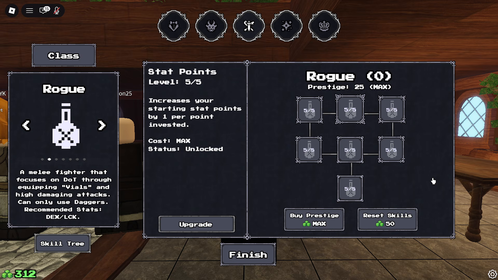
- **Role Definition**: Rogue is designated as a melee fighter utilizing Daggers and specialized "Vials" to trigger Damage-over-Time (DoT). Recommended stats: `DEX` / `LCK`.
- **Pre-run Progression**:
  - Skill Tree with node levels (e.g., `Stat Points Level 5/5` granting +1 starting stat per point).
  - Prestige system (`Prestige: 25 (MAX)`) and skill reset currency.

---

### 2.2 Race Selection & Passive Traits
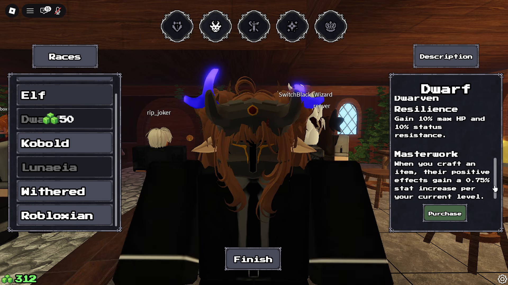
- **Races**: Elf, Dwarf, Kobold, Lunaeia, Withered, Robloxian.
- **Example Passives (Dwarf)**:
  - *Dwarven Resilience*: +10% Max HP and +10% Status Resistance.
  - *Masterwork*: Crafted item positive effects scale +0.75% per current level.
- **Synergy Note**: Dwarf's extra HP and status resistance compensates for Rogue's inherent squishiness.

---

### 2.3 Boon / Perk Slotting System
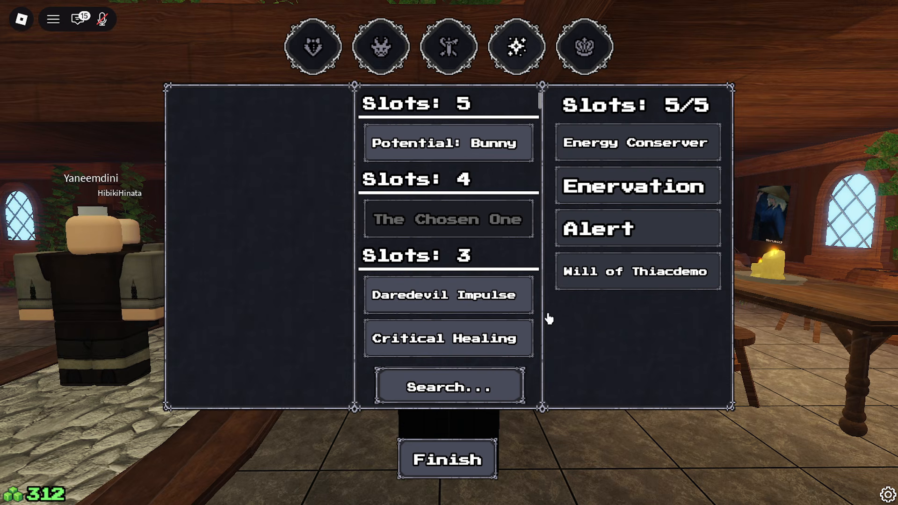
- **Mechanic**: Capacity system (Total 5 Slots). Each Boon has an associated slot cost:
  - **Energy Conserver** (2 Slots): 15% chance to gain +1 additional Energy at turn start.
  - **Enervation** (2 Slots): +5% multiplicative damage per unique DoT on target (up to 1.4x), +15% DoT damage dealt, but take 1.15x more debuff damage.
  - **Alert** (1 Slot): +3 Initiative bonus; first 2 turns of combat gain +5% Block and Dodge chance.
  - **Total**: 2 + 2 + 1 = 5/5 slots.

---

### 2.4 Combat Layout & Initiative Timeline
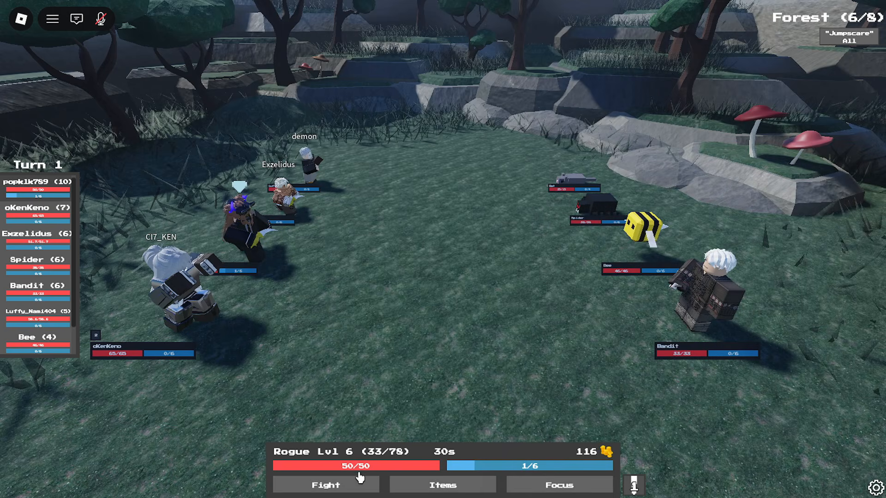
- **Region & Layer Tracker**: Top-right corner displays current node (e.g., `Forest (6/8)` with modifiers like `"Jumpscare" All`).
- **Initiative Order (Left Side)**:
  - Displays turn sequence from top to bottom (e.g., `popk1k789 (10)`, `oKenKeno (7)`, `Exzelidus (6)`, `Spider (6)`, `Bandit (6)`, `Luffy (5)`, `Bee (4)`).
  - Every combatant tile displays current HP (red) and Energy (blue).
- **Player HUD (Bottom)**:
  - Character status: `Rogue Lvl 6 (33/78 EXP)`.
  - Turn Action Timer: `30s` (in *BEYOND THE WORLD'S END*, specified as 15s Action Window).
  - Currency: `116 Gold`.
  - Resource Bars: HP `50/50`, Energy segmented bar `1/6`.
  - Main Action Buttons: `[ Fight ]`, `[ Items ]`, `[ Focus ]`.

---

### 2.5 Action Selection & Cooldown Management
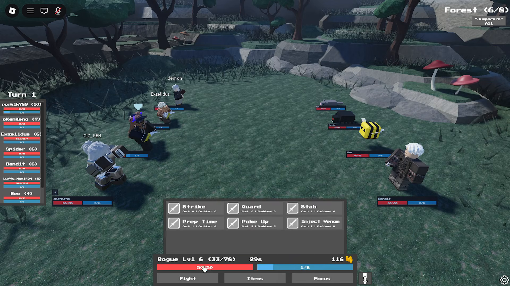
- **Skill Menu Structure**:
  - `Strike`: Cost 0 Energy | Cooldown 0 (Standard basic attack).
  - `Guard`: Cost 0 Energy | Cooldown 0 (Defend action).
  - `Stab`: Cost 1 Energy | Cooldown 4.
  - `Prep Time`: Cost 1 Energy | Cooldown 6 (Buffs weapon with toxin/poison).
  - `Poke Up`: Cost 2 Energy | Cooldown 3 (High DoT application combo).
  - `Inject Venom`: Cost 2 Energy | Cooldown 6.

---

### 2.6 Skill Execution Feedback
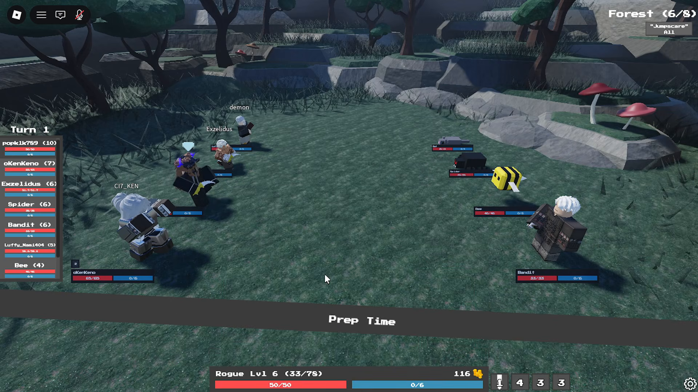
- When an ability is used, a prominent banner (`Prep Time`) animates across the bottom screen.
- Energy is consumed immediately, and cooldown timers display directly over the skill buttons.

---

### 2.7 DoT Debuff Stacking & Tick Phase
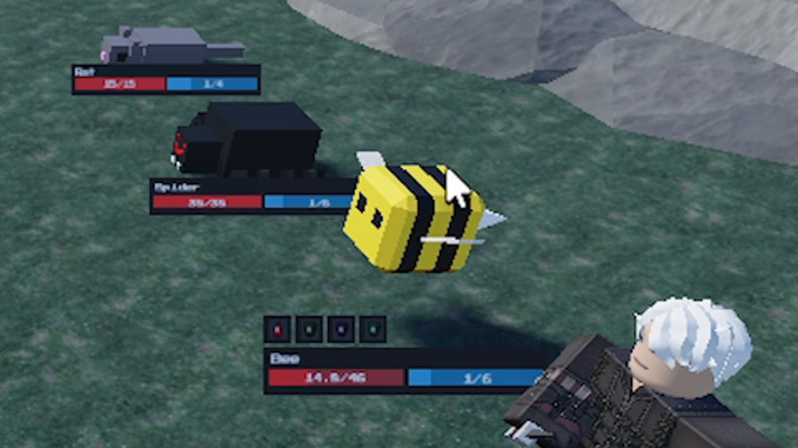
- **Multi-DoT Display**: Floating status icons above target health bar indicate active debuffs (Red = Bleed, Green = Poison, Purple = Toxin, Blue = Frost/Slow).
- **Damage Numbers**: Distinct color-coded floating text on tick (e.g., green `-4.5` for poison ticks, red `-3.5` for bleed).
- **Synergy Loop**: Enervation multiplies attack damage as the target accumulates distinct DoT types.

---

### 2.8 Campfire / Rest / Preparation Screen
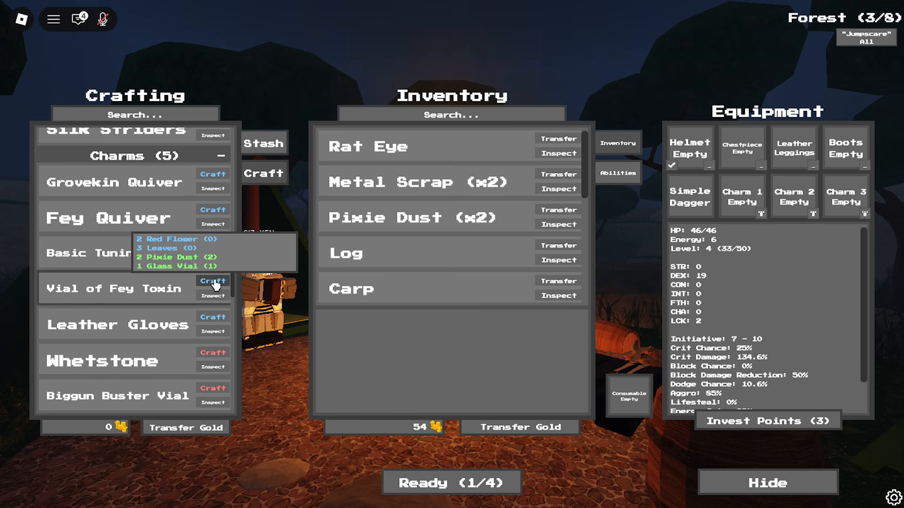
- **3-Column Workspace**:
  1. **Crafting (Left)**: Filterable recipe list (Boots, Robes, Charms/Vials, Quivers). Hovering reveals ingredient requirements (e.g., *Vial of Fey Toxin*: 2 Red Flower, 3 Leaves, 2 Pixie Dust, 1 Glass Vial).
  2. **Inventory (Middle)**: Shared/Personal item storage (Monster drops like Rat Eye, Metal Scrap, Pixie Dust, Honey, Logs). Buttons for `[ Transfer ]` and `[ Inspect ]`. Bottom bar includes `[ Transfer Gold ]`.
  3. **Equipment & Stats (Right)**: Visual slot grid and live stat sheet with `[ Invest Points ]`.
- **Co-op Flow**: Bottom center `[ Ready (1/4) ]` syncs all party members before advancing to the next Layer.

---

### 2.9 Equipment Grid & Character Attributes
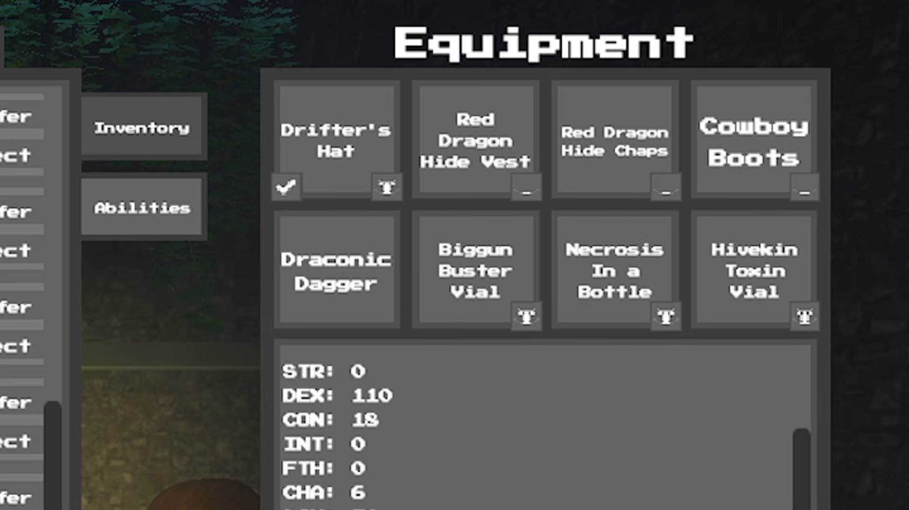
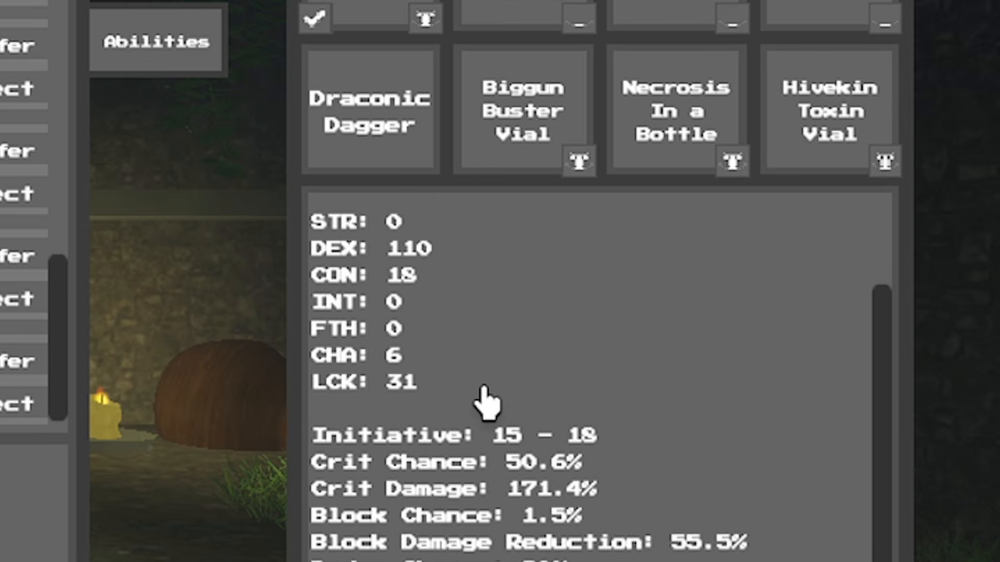

#### Equipment Slots:
- **Armor (4 Slots)**: Helmet (`Drifter's Hat`), Chestpiece (`Red Dragon Hide Vest`), Leggings (`Red Dragon Hide Chaps`), Boots (`Cowboy Boots`).
- **Weapon (1 Slot)**: Main weapon (`Draconic Dagger`).
- **Charms / Vials (3 Slots)**: Accessory slots (`Biggun Buster Vial`, `Necrosis in a Bottle`, `Hivekin Toxin Vial`).
- **Consumable (1 Slot)**: In-combat usable item.

#### Stat Architecture:
- **Primary Attributes**:
  - `STR`: Strength (Physical power)
  - `DEX`: Dexterity (Rogue damage, initiative, dodge)
  - `CON`: Constitution (Max HP, survivability)
  - `INT`: Intelligence (Magic power, spell scaling)
  - `FTH`: Faith (Support/healing scaling)
  - `CHA`: Charisma (Barter, shop prices, party utility)
  - `LCK`: Luck (Crit rate, loot drops)
- **Derived Combat Stats**:
  - Initiative (e.g. `15 - 18`)
  - Crit Chance (`50.6%`) & Crit Damage (`171.4%`)
  - Block Chance (`1.5%`) & Block Damage Reduction (`55.5%`)
  - Dodge Chance
  - Aggro Modifier (`85%`)
  - Lifesteal (`0%`)
  - Energy Regen

---

### 2.10 Layer Progression & Combat Rewards
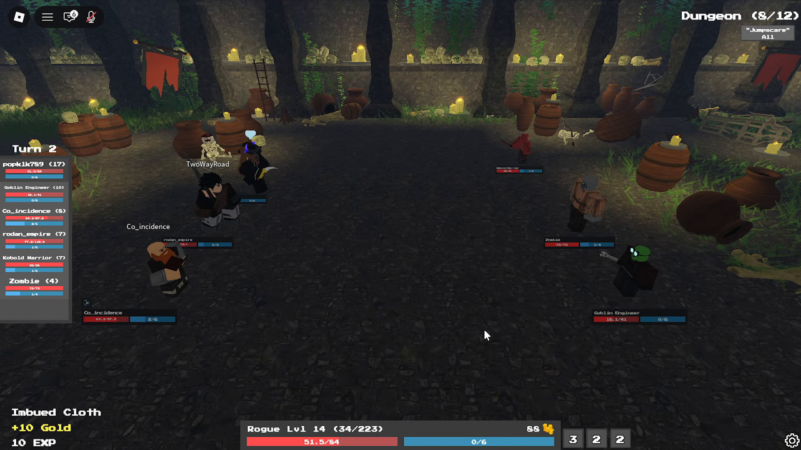
- Top right shows region layer: `Dungeon (8/12)`.
- Bottom left reward banner shows immediate post-combat drops: Material items (`Imbued Cloth`), Gold (`+10 Gold`), and Character EXP (`10 EXP`).

---

## 3. Practical Recommendations for BEYOND THE WORLD'S END

| AAC Feature | BEYOND THE WORLD'S END Specification | Adaptation / Implementation Guidance |
| :--- | :--- | :--- |
| **Player Count** | 4 Players | **5 Character Party** (single-player or duo co-op with AI fill slots, see ADR-0002). Ensure UI supports 5 character slots cleanly. |
| **Action Window** | 30s timer | **15s Action Window** (per CONTEXT.md). Auto-defend if timer expires. Keep action UI rapid and clear. |
| **Class Progression** | Start with base class | **Classless start** → Tier 1 Class unlocked via Forest Class Encounters (Swordsman, Archer, Mage, Guardian, Rogue). |
| **Turn Order HUD** | Vertical list on left | Keep the initiative timeline showing both HP and Energy bars for allies and enemies. |
| **DoT System** | Bleed + Poison + Toxin + Vials | Adopt multi-DoT categorization with visual status badges over models. Implement multiplicative traits for high-risk builds. |
| **Rest/Camp Screen** | 3-Column Craft/Inventory/Equip | Adopt this layout for Rest / Merchant Encounters. Include gold/item transfer and "Ready (x/5)" voting. |
