# AAC (An Average Campaign) — ข้อมูลอ้างอิงชุดตัวละคร Rogue และระบบเกม

> **แหล่งอ้างอิง**: [AAC - เล่น Rogue พื้นฐานยังไง??](https://www.youtube.com/watch?v=6BFlpdljkA8)
> **ช่อง**: Satoshi Sensei Ch
> **แพลตฟอร์ม / เอนจินในภาพอ้างอิง**: Roblox (An Average Campaign - เกมสวมบทบาทร่วมมือแบบผลัดตาเดินและโร้กไลต์)
> **บริบทของโครงการ**: ข้อมูลอ้างอิงสำหรับวงจรการต่อสู้ *BEYOND THE WORLD'S END*, การเสริมกันของอาชีพและพร, โครงสร้างความเสียหายต่อเนื่อง, การคราฟต์และ UI ค่ายพัก และการจัดการทรัพยากรแบบร่วมมือกัน

---

## 1. สรุปและความเกี่ยวข้องกับ BEYOND THE WORLD'S END

*An Average Campaign (AAC)* ทำหน้าที่เป็นภาพอ้างอิงสำคัญสำหรับเกมสวมบทบาทกลุ่มแบบผลัดตาเดินที่เล่นเป็นรอบแบบโร้กไลต์ วิดีโอนี้แจกแจงรายละเอียดชุดความสามารถ **Rogue (นักฆ่าสายความเสียหายต่อเนื่อง)** ซึ่งแสดงให้เห็นว่าความก้าวหน้าของตัวละคร การเสริมกันของพรและความสามารถติดตัว การใช้พลังงานในแต่ละเทิร์น การคราฟต์และคลังของกลุ่มทำงานร่วมกันในการเล่นหลายคนอย่างไร

### ประเด็นสำคัญสำหรับ BEYOND THE WORLD'S END:
1. **การเสริมกันของสถานะความเสียหายต่อเนื่อง**: สถานะความเสียหายต่อเนื่องต่างชนิด (เลือดไหล, พิษ, พิษร้าย) จะซ้อนกันพร้อมกัน โดยจะขยายความเสียหายแบบทวีคูณผ่านลักษณะเช่น *อ่อนแรง* (ความเสียหาย +5% ต่อสถานะความเสียหายต่อเนื่องต่างชนิด สูงสุด 1.4 เท่า)
2. **การจัดการพลังงานและคูลดาวน์**: ทักษะต้องใช้ พลังงาน (1–2) และมีคูลดาวน์ (3–6 เทิร์น) เทิร์นที่ 1 มุ่งเน้นไปที่บัฟอาวุธ (*เตรียมพิษ*), เทิร์นที่ 2 สำหรับการโจมตีพื้นฐานฟรี (*โจมตี*) และเทิร์นที่ 3 สำหรับคอมโบที่มีพลังโจมตีสูง (*แทงซ้ำ* / *ฉีดพิษ*)
3. **รูปแบบ UI ของค่ายพัก**: เค้าโครง 3 คอลัมน์ที่สะอาดตาระหว่างจุดพัก: [คราฟต์ / สูตร] | [ไอเทมของกลุ่ม / คลัง] | [อุปกรณ์และค่าสถานะทั้งหมด]
4. **การโอนทรัพยากรแบบร่วมมือกัน**: การโอนไอเท็มระหว่างผู้เล่นโดยตรงและการโอนทองระหว่างแคมป์ ควบคู่ไปกับการยืนยันความพร้อมร่วมกัน "Ready (x/4)"

---

## 2. รายละเอียดภาพอ้างอิงและส่วนประกอบ UI

### 2.1 การเลือกอาชีพและผังทักษะ
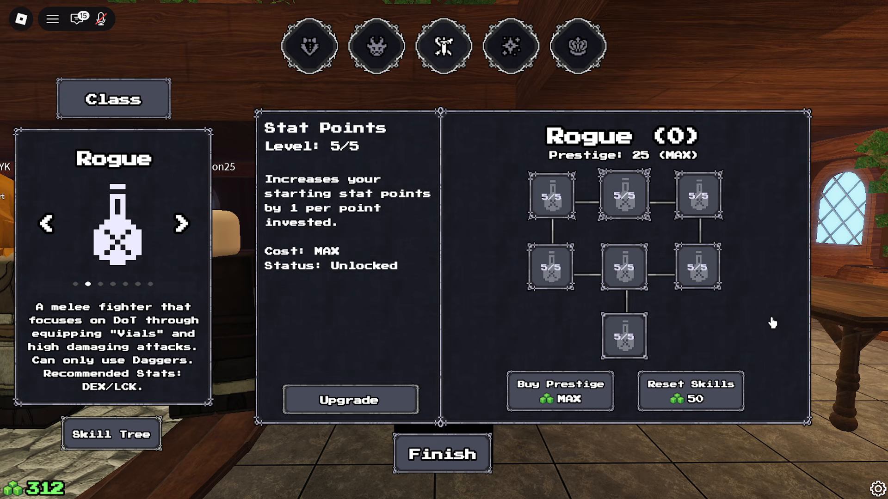
- **บทบาท**: Rogue ถูกกำหนดให้เป็นนักสู้ระยะประชิดที่ใช้มีดสั้นและ "ขวดยา" พิเศษเพื่อกระตุ้นความเสียหายต่อเนื่อง (DoT) สถิติที่แนะนำ: `DEX` / `LCK`
- **ความก้าวหน้าก่อนเริ่มรอบ**:
  - ผังทักษะที่มีระดับโหนด (เช่น `Stat Points Level 5/5` มอบสถิติเริ่มต้น +1 ต่อจุด)
  - ระบบเกียรติยศ (`Prestige: 25 (MAX)`) และสกุลเงินรีเซ็ตทักษะ

---

### 2.2 การเลือกเผ่าพันธุ์และความสามารถติดตัว
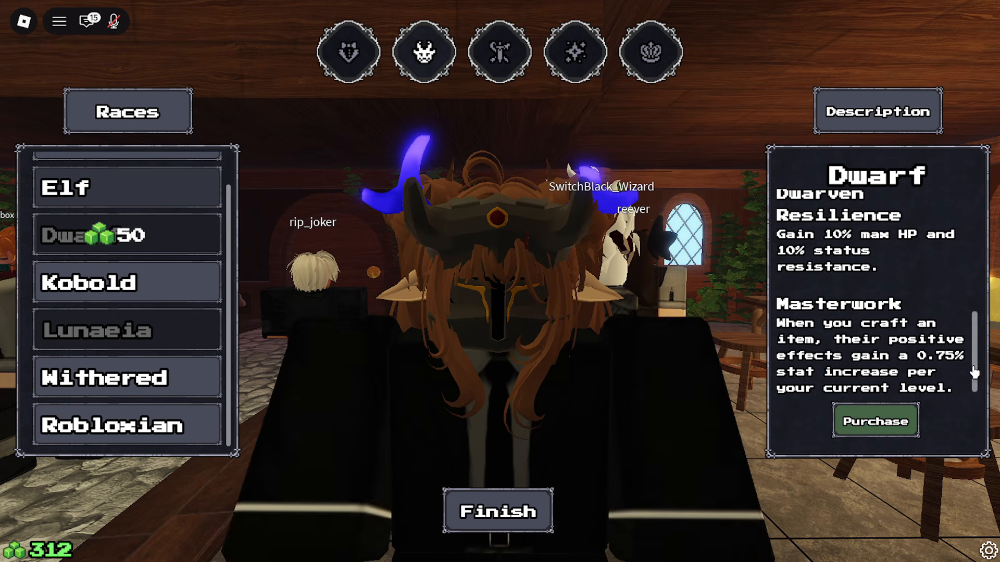
- **เผ่าพันธุ์**: เอลฟ์, คนแคระ, โคโบลด์, ลูนาเอีย, ผู้เหี่ยวเฉา, Robloxian
- **ตัวอย่างความสามารถติดตัว (คนแคระ)**:
  - *ความทรหดของคนแคระ*: +10% HP สูงสุด และต้านทานสถานะ +10%
  - *งานฝีมือชั้นเยี่ยม*: สเกลเอฟเฟกต์ด้านบวกของไอเทมที่สร้างขึ้น +0.75% ต่อระดับปัจจุบัน
- **หมายเหตุการทำงานร่วมกัน**: HP พิเศษและความต้านทานสถานะของ คนแคระ จะชดเชยความเปราะบางของ Rogue

---

### 2.3 ระบบช่องพร
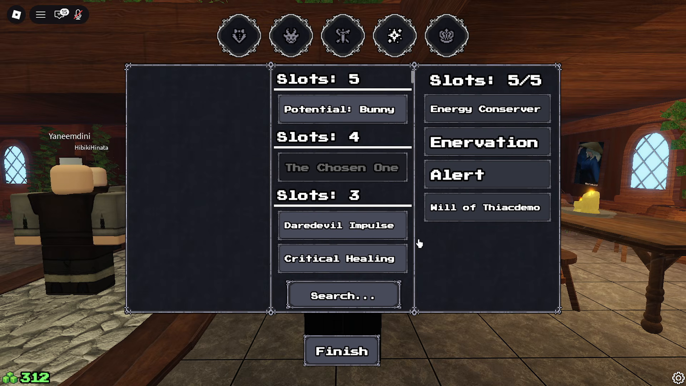
- **กติกา**: ระบบความจุ (รวม 5 ช่อง) พร แต่ละอันมีค่าใช้จ่ายสล็อตที่เกี่ยวข้อง:
  - **ผู้ประหยัดพลังงาน** (2 ช่อง): โอกาส 15% ที่จะได้รับ พลังงาน เพิ่มเติม +1 เมื่อเริ่มเทิร์น
  - **อ่อนแรง** (2 ช่อง): +5% ความเสียหายแบบทวีคูณต่อสถานะความเสียหายต่อเนื่องต่างชนิดบนเป้าหมาย (สูงสุด 1.4x), +15% ความเสียหาย DoT ที่ทำได้ แต่ได้รับความเสียหายดีบัฟเพิ่มขึ้น 1.15 เท่า
  - **ตื่นตัว** (1 ช่อง): โบนัส +3 ชิงจังหวะ; การต่อสู้ 2 เทิร์นแรกได้รับโอกาส ปัดป้อง และ หลบหลีก +5%
  - **ทั้งหมด**: 2 + 2 + 1 = 5/5 ช่อง

---

### 2.4 หน้าต่อสู้และลำดับชิงจังหวะ
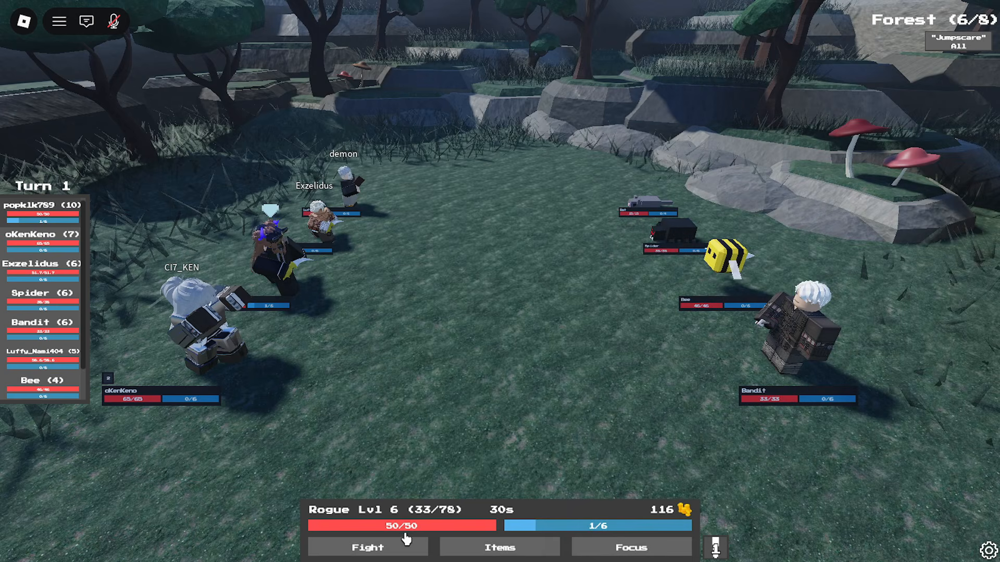
- **ตัวติดตามภูมิภาคและ ชั้น**: มุมขวาบนแสดงโหนดปัจจุบัน (เช่น `Forest (6/8)` พร้อมตัวปรับแต่ง เช่น `"Jumpscare" All`)
- **คำสั่ง ชิงจังหวะ (ด้านซ้าย)**:
  - แสดงลำดับเทิร์นจากบนลงล่าง (เช่น `popk1k789 (10)`, `oKenKeno (7)`, `Exzelidus (6)`, `Spider (6)`, `Bandit (6)`, `Luffy (5)`, `Bee (4)`)
  - ช่องนักสู้ทุกช่องจะแสดง HP ปัจจุบัน (สีแดง) และ พลังงาน (สีน้ำเงิน)
- **HUD ผู้เล่น (ด้านล่าง)**:
  - สถานะตัวละคร: `Rogue Lvl 6 (33/78 EXP)`
  - ตัวจับเวลากรอบเวลาแอ็กชัน: `30s` (ใน *BEYOND THE WORLD'S END* ระบุเป็นหน้าต่างการดำเนินการ 15 วินาที)
  - สกุลเงิน: `116 Gold`.
  - แถบทรัพยากร: HP `50/50`, พลังงาน แถบแบ่งส่วน `1/6`
  - ปุ่มการทำงานหลัก: `[ Fight ]`, `[ Items ]`, `[ Focus ]`

---

### 2.5 การเลือกคำสั่งและจัดการคูลดาวน์
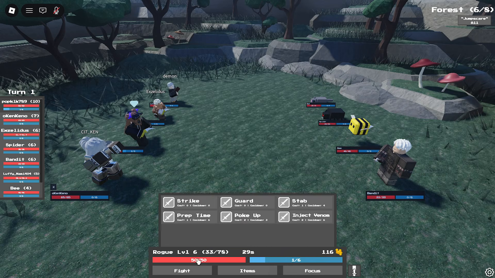
- **โครงสร้างเมนูทักษะ**:
  - `Strike`: ใช้พลังงาน 0 | คูลดาวน์ 0 (การโจมตีพื้นฐานมาตรฐาน)
  - `Guard`: ใช้พลังงาน 0 | คูลดาวน์ 0 (ป้องกันการกระทำ)
  - `Stab`: ใช้พลังงาน 1 | คูลดาวน์4.
  - `Prep Time`: ใช้พลังงาน 1 | คูลดาวน์ 6 (บัฟอาวุธด้วยสารพิษ/พิษ)
  - `Poke Up`: ใช้พลังงาน 2 | คูลดาวน์ 3 (คอมโบแอปพลิเคชัน ความเสียหายต่อเนื่องสูง)
  - `Inject Venom`: ใช้พลังงาน 2 | คูลดาวน์ 6.

---

### 2.6 การแจ้งผลเมื่อใช้ทักษะ
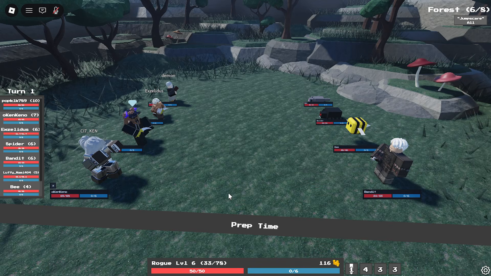
- เมื่อใช้ความสามารถ แบนเนอร์ที่โดดเด่น (`Prep Time`) จะเคลื่อนไหวทั่วทั้งหน้าจอด้านล่าง
- พลังงาน จะถูกใช้งานทันที และเวลาคูลดาวน์จะแสดงเหนือปุ่มทักษะโดยตรง

---

### 2.7 การสะสมสถานะความเสียหายต่อเนื่องและจังหวะหักพลังชีวิต
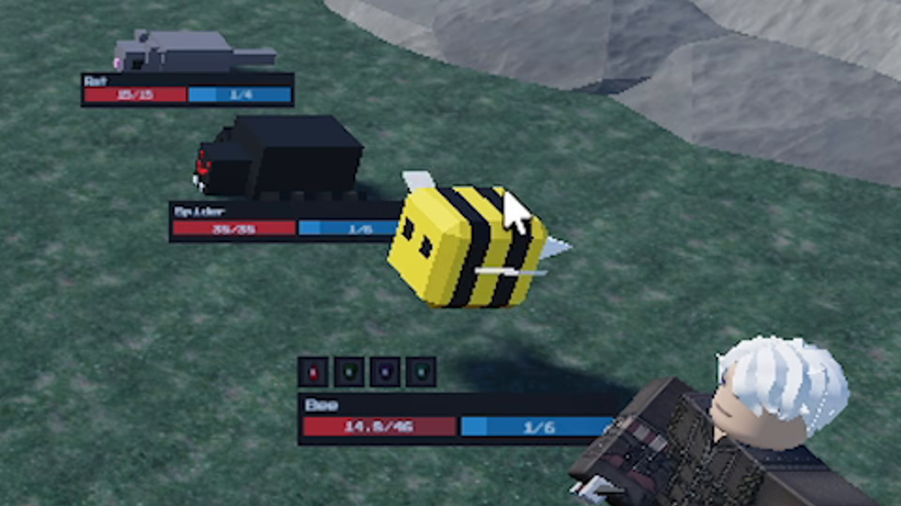
- **การแสดงหลายสถานะพร้อมกัน**: ไอคอนสถานะลอยอยู่เหนือแถบพลังชีวิตเป้าหมายบ่งบอกถึงดีบัฟที่ใช้งานอยู่ (แดง = เลือดออก, สีเขียว = พิษ, สีม่วง = สารพิษ, สีน้ำเงิน = เย็นจัด/ช้าลง)
- **หมายเลขความเสียหาย**: ตัวเลขความเสียหายลอยแยกสีเมื่อสถานะออกผล (เช่น สีเขียว `-4.5` สำหรับพิษ สีแดง `-3.5` สำหรับเลือดออก)
- **วงจรการเสริมกัน**: อ่อนแรง เพิ่มความเสียหายจากการโจมตีเมื่อเป้าหมายสะสมประเภท DoT ที่แตกต่างกัน

---

### 2.8 หน้าค่ายพักและเตรียมตัว
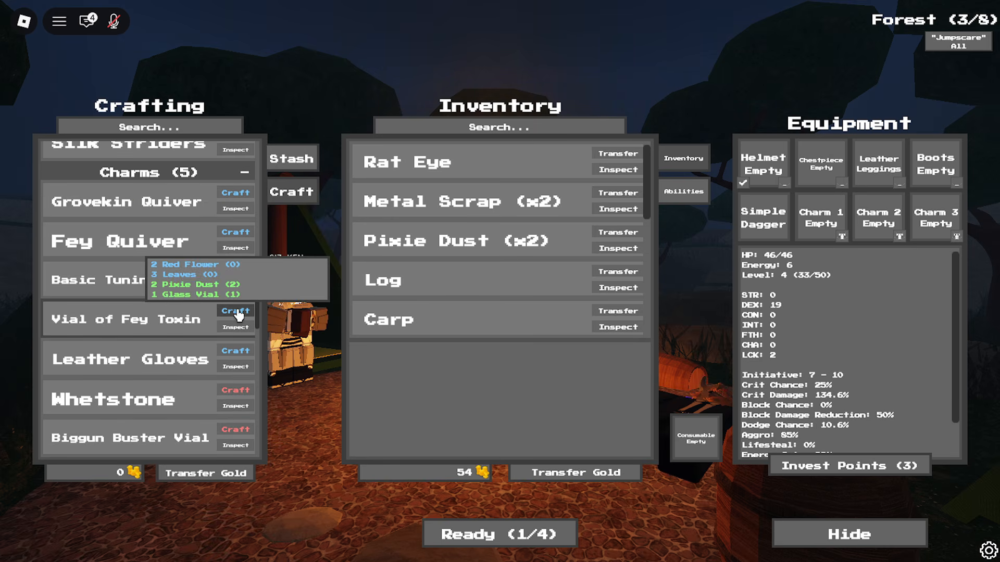
- **พื้นที่ทำงาน 3 คอลัมน์**:
  1. **การคราฟต์ (ซ้าย)**: รายการสูตรอาหารที่กรองได้ (รองเท้าบูท เสื้อคลุม เครื่องราง/ขวดยา กระบอกธนู) การวางเมาส์เหนือจะแสดงข้อกำหนดส่วนผสม (เช่น *ขวด Fey Toxin*: ดอกไม้สีแดง 2 ดอก, ใบไม้ 3 ใบ, ฝุ่น Pixie 2 ชิ้น, ขวดแก้ว 1 ขวด)
  2. **คลังไอเทม (กลาง)**: พื้นที่จัดเก็บสิ่งของที่ใช้ร่วมกัน/ส่วนตัว (ดรอปมอนสเตอร์ เช่น ตาหนู เศษโลหะ ฝุ่น Pixie น้ำผึ้ง ท่อนไม้) ปุ่มสำหรับ `[ Transfer ]` และ `[ Inspect ]` แถบด้านล่างประกอบด้วย `[ Transfer Gold ]`
  3. **อุปกรณ์และสถิติ (ขวา)**: ตารางตารางช่องสวมใส่และค่าสถานะปัจจุบันพร้อม `[ Invest Points ]`
- **ขั้นตอนความร่วมมือ**: `[ Ready (1/4) ]` ตรงกลางด้านล่างจะซิงค์สมาชิกปาร์ตี้ทั้งหมดก่อนที่จะก้าวไปสู่ ​​ชั้น ถัดไป

---

### 2.9 ช่องอุปกรณ์และคุณลักษณะตัวละคร
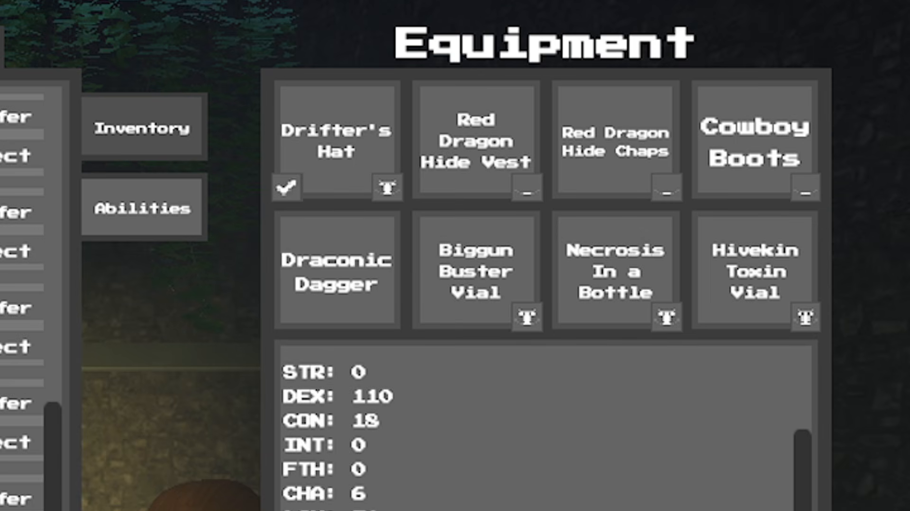
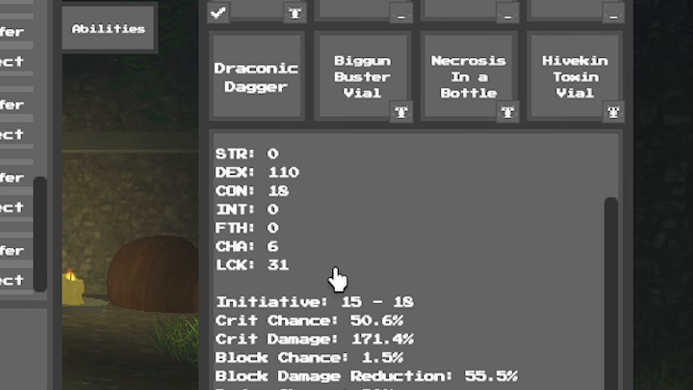

#### ช่องอุปกรณ์:
- **เกราะ (4 ช่อง)**: หมวกกันน็อค (`Drifter's Hat`), หน้าอก (`Red Dragon Hide Vest`), กางเกงรัดรูป (`Red Dragon Hide Chaps`), รองเท้าบูท (`Cowboy Boots`)
- **อาวุธ (1 ช่อง)**: อาวุธหลัก (`Draconic Dagger`)
- **เครื่องราง / ขวด (3 ช่อง)**: ช่องใส่อุปกรณ์เสริม (`Biggun Buster Vial`, `Necrosis in a Bottle`, `Hivekin Toxin Vial`)
- **ไอเทมใช้ครั้งเดียว (1 ช่อง)**: ไอเทมที่ใช้งานได้ระหว่างการต่อสู้

#### โครงสร้างค่าสถานะ:
- **คุณสมบัติหลัก**:
  - `STR`: ความแข็งแกร่ง (พลังกาย)
  - `DEX`: ความคล่องแคล่ว (ความเสียหายของ Rogue, ความคิดริเริ่ม, หลบหลีก)
  - `CON`: Constitution (Max HP, ความอยู่รอด)
  - `INT`: Intelligence (พลังเวทย์, สเกลคาถา)
  - `FTH`: ศรัทธา (สเกลสนับสนุน/การรักษา)
  - `CHA`: Charisma (การแลกเปลี่ยน, ราคาร้านค้า, ยูทิลิตี้ปาร์ตี้)
  - `LCK`: โชค (อัตราคริติคอล, ดรอปไอเทม)
- **สถิติ การต่อสู้ ที่ได้รับ**:
  - ชิงจังหวะ (เช่น `15 - 18`)
  - โอกาสคริติคอล (`50.6%`) และความเสียหายคริติคอล (`171.4%`)
  - โอกาส ปัดป้อง (`1.5%`) & การลดความเสียหายของ ปัดป้อง (`55.5%`)
  - โอกาส หลบหลีก
  - ตัวดัดแปลง Aggro (`85%`)
  - ดูดพลังชีวิต (`0%`)
  - การฟื้นพลังงาน

---

### 2.10 ความก้าวหน้าแต่ละชั้นและรางวัลต่อสู้
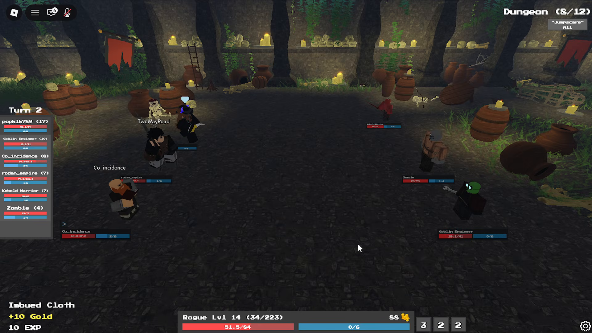
- ด้านบนขวาแสดงเลเยอร์ขอบเขต: `Dungeon (8/12)`
- แบนเนอร์รางวัลด้านล่างซ้ายจะแสดงการดรอปหลังการต่อสู้ทันที: รายการวัสดุ (`Imbued Cloth`), ทอง (`+10 Gold`) และ EXP ตัวละคร (`10 EXP`)

---

## 3. ข้อเสนอสำหรับ BEYOND THE WORLD'S END

| คุณสมบัติ AAC | BEYOND THE WORLD'S END ข้อมูลจำเพาะ | แนวทางการปรับตัว / การนำไปปฏิบัติ |
| :--- | :--- | :--- |
| **จำนวนผู้เล่น** | ผู้เล่น 4 คน | **กลุ่มตัวละคร 5 คน** (เล่นคนเดียวหรือเล่นคู่ร่วมกับช่องเติม AI ดู ADR-0002) ตรวจสอบให้แน่ใจว่า UI รองรับช่องอักขระ 5 ช่องอย่างสมบูรณ์ |
| **หน้าต่างการดำเนินการ** | จับเวลา 30 วินาที | **หน้าต่างการดำเนินการ 15 วินาที** (ตาม CONTEXT.md) ป้องกันอัตโนมัติหากหมดเวลา ทำให้ Action UI รวดเร็วและชัดเจน |
| **อาชีพ ความก้าวหน้า** | เริ่มต้นด้วยคลาสพื้นฐาน | **เริ่มแบบไร้อาชีพ** → อาชีพ ระดับ 1 ปลดล็อคผ่านการเผชิญหน้า อาชีพ ในป่า (นักดาบ, นักธนู, นักเวท, ผู้พิทักษ์, Rogue) |
| **HUD ลำดับเทิร์น** | รายการแนวตั้งทางซ้าย | เก็บลำดับชิงจังหวะที่แสดงทั้งแถบ HP และ พลังงาน สำหรับพันธมิตรและศัตรู |
| **ระบบดอท** | เลือดออก + พิษ + สารพิษ + ขวด | ใช้การจัดหมวดหมู่แบบ multi-DoT พร้อมป้ายสถานะแบบภาพเหนือโมเดล ใช้ลักษณะการคูณสำหรับบิลด์ที่มีความเสี่ยงสูง |
| **พัก/หน้าจอค่าย** | หน้าคราฟต์/คลังไอเทม/อุปกรณ์สามคอลัมน์ | ใช้เค้าโครงนี้สำหรับการเผชิญหน้า พัก / พ่อค้า รวมการโอนทอง/ไอเท็ม และการโหวต "พร้อม (x/5)" |
